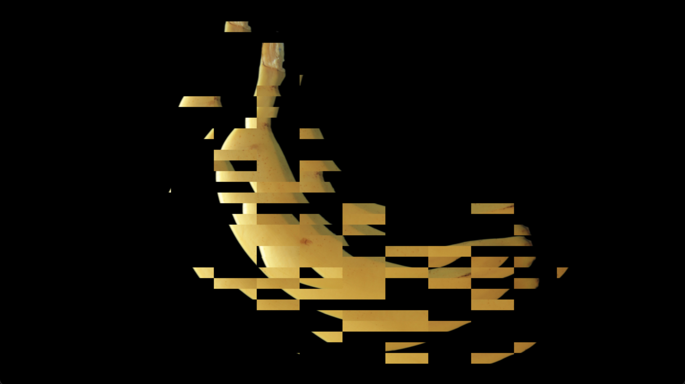

[日本語](./README.md) | English

# TouchDesigner Plugins  
This section contains custom additional features for TouchDesigner.  
Since I use a Mac, the operation of DLLs has not been verified.  
- [Palette](#palette)  
    - [Installation](#palette-installation)  
    - [Description](#palette-description)  
- [Plugin](#plugin)  
    - [Installation](#plugin-installation)  
    - [Description](#plugin-description)  
        - [CHOP](#chop)
        - [TOP](#top)
  
## Palette  
This is like the presets found in the left tab of TouchDesigner.  
  
  
### Palette Installation  
You can use a `.tox` file from [Palettes](Palettes) by dragging and dropping it into your project.  
  
*For details, please refer to [https://derivative.ca/UserGuide/Palette](https://derivative.ca/UserGuide/Palette)* ### Palette Description
1. [identifyUV](Palette/identifyUV.tox)  
    This is the initial UV state.
2. [mandrauv](Palette/mandrauv.tox)  
    This UV easily creates mandala patterns (symmetrical geometric patterns).  
    Usage Example: [MandraExample.toe](Projects/MandraExample.toe)  
3. [pinholeRadtan](Palette/pinholeRadtan.tox)  
    This UV expands/contracts a part of an image.  
    Usage Example: [PinholeRadtanExample.toe](Projects/PinholeRadtanExample.toe)  
4. [lineDrawer](Palette/lineDrawer.tox)  
    Draws lines by specifying coordinates and colors with CHOP.  
    Usage Example: [LineDrawerExample.toe](Projects/LineDrawerExample.toe "LineDrawer Usage Example")  
      
  
## Plugin  
These are like original nodes for TouchDesigner.  
If installed correctly, they will be added to the `Custom` tab of the Operator selection window.  
  
  
### Plugin Installation  
- Windows  
    Select the desired plugin (`.dll`) file from [Plugins/Windows](Plugins/Windows) and place it in  
    `Documents/Derivative/Plugins`  
    or  
    `C:/Users/<username>/Documents/Derivative/Plugins`  
- Mac  
    Select the desired plugin (`.plugin`) file from [Plugins/Mac](Plugins/Mac) and place it in  
    `/Users/<username>/Library/Application Support/Derivative/TouchDesigner099/Plugins`  
  
*For details, please refer to [https://docs.derivative.ca/Custom_Operators](https://docs.derivative.ca/Custom_Operators)* ### Plugin Description  
#### CHOP
1. `DotCHOP`  
    Calculates the dot product of two CHOPs.  
    Usage Example: [DotProductCHOPExample.toe](Projects/DotProductCHOPExample.toe "DotProductCHOP Usage Example")  
2. `GranularCHOP`
    Applies a simple granular effect to a CHOP.  
    Applying it twice yields a good result.  
    Usage Example 1: [TouchDesigner Plugin "Granular"](https://youtu.be/0uRVfFLauyg "TouchDesigner Plugin Granular YouTube")  
    Usage Example 2: [GranularCHOPExample.toe](Projects/GranularCHOPExample.toe "GranularCHOP Usage Example")  
3. `HistogramCHOP`  
    Calculates the histogram of a CHOP.  
    Usage Example: [HistogramCHOPExample.toe](Projects/HistogramCHOPExample.toe "HistogramCHOP Usage Example")  
4. `MIDIFileInCHOP`  
    Easily reads MIDI files (fewer features and simpler to use than `MIDI In`).  
5. `SoundFontSynthCHOP`  
    Plays SoundFont files. Intended to be used with `MIDIFileInCHOP`.  
  
#### TOP
1. `BasicBlockGlitchTOP`  
    Breaks an image into tiles. Can also be animated sequentially.  
    Usage Example: [BasicBlockGlitchTOPExample.toe](Projects/BasicBlockGlitchTOPExample.toe)  
      
2. `BlockNoiseTOP`  
    Simply adds square noise. `TOP > Noise` might also work.  
    Usage Example: [BlockNoiseTOPExample.toe](Projects/BlockNoiseTOPExample.toe)  
      
3. `BitCrushTOP`  
    Quantizes image colors by bit. Can be used to express older video aesthetics.  
    Usage Example: [BitCrushTOPExample.toe](Projects/BitCrushTOPExample.toe)  
      
4. `PixcelSorterGlitchTOP`  
    Inspired by Kim Asendorf's [ASDFPixelSort](https://github.com/kimasendorf/ASDFPixelSort), this is a TouchDesigner plugin for Pixel Sorting. (You can select modes such as Black, Brightness, R, G, B, RGBMax).  
    Usage Example: [PixcelSorterGlitchTOPExample.toe](Projects/PixcelSorterGlitchTOPExample.toe)  
      
5. `FlipnoteTOP`  
    Adjusts image quality, aspect ratio, and content to a "Flipnote Studio" style. You can choose between DSi/3DS versions.  
    As a reference, moving `DitherLevels` changes the density of dots, `DitherLumaThreshold` changes vibrancy, and Edge-related parameters control contour emphasis. No parameter set has been found that yields good results universally across many images.  
    In the Operator's parameter settings window, setting `Common > Viewer Smoothness` to `Nearest Pixel` further enhances the "Flipnote Studio" look.  
    Usage Example: [FlipnoteTOPExample.toe](Projects/FlipnoteTOPExample.toe)  
    
6. `InstanceTOP`  
    A plugin that duplicates an input image, transforms it with CHOP, and overlays it.  
    Usage Example: [InstanceTOPExample.toe](Projects/InstanceTOPExample.toe)  
    