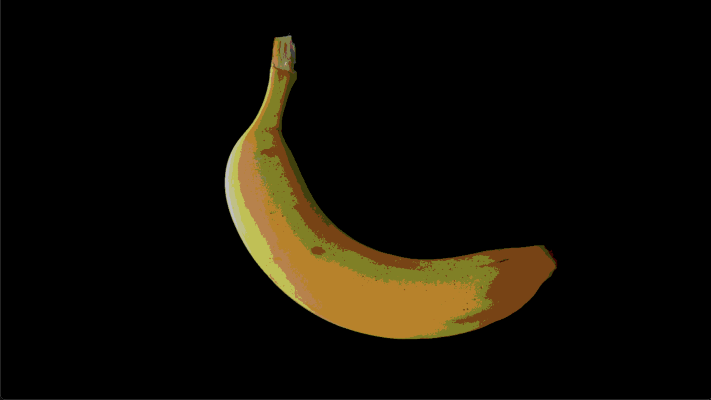

# Touch Designer Plugins  
自作したTouchDesigner用の追加機能などを置いてます.  
- [Palette](#palette)  
	- [導入](#palette導入)  
	- [説明](#palette説明)  
- [Plugin](#plugin)  
	- [導入](#plugin導入)  
	- [説明](#plugin説明)  
  
## Palette  
TouchDesignerの左側のタブにあるプリセットみたいなやつです.  
  
  
### Palette導入  
[Palettes](Palettes)の中から使いたい`.tox`ファイルを選んでプロジェクト内にDrag＆Dropで使うことができます.  
  
*詳細は[https://derivative.ca/UserGuide/Palette](https://derivative.ca/UserGuide/Palette)を確認してください*  
  
### Palette説明  
1. [mandrauv](Palette/mandrauv.tox)  
	曼荼羅模様(シンメトリーな幾何学模様)を簡単に作れるUV.  
	使用例: [MandraExample.toe](Projects/MandraExample.toe)  
2. [pinholeRadtan](Palette/pinholeRadtan.tox)  
	画像の一部を膨張/縮小するUV.  
	使用例: [PinholeRadtanExample.toe](Projects/PinholeRadtanExample.toe)  
  
## Plugin  
TouchDesignerのオリジナルノードみたいなやつです.  
上手く導入できるとOperatorの選択ウィンドウの`Custom`タブに追加されます.  
  
  
### Plugin導入  
- Windows  
	[Plugins/Windows](Plugins/Windows)内から使いたいプラグイン(`.dll`)ファイルを選び  
	`Documents/Derivative/Plugins`  
	もしくは、  
	`C:/Users/<username>/Documents/Derivative/Plugins`  
	内に配置する  
- Mac  
	[Plugins/Mac](Plugins/Mac)内から使いたいプラグイン(`.plugin`)ファイルを選び  
	`/Users/<username>/Library/Application Support/Derivative/TouchDesigner099/Plugins`  
	内に配置する  
  
*詳細は[https://docs.derivative.ca/Custom_Operators](https://docs.derivative.ca/Custom_Operators)を確認してください*  
  
### Plugin説明  
1. `DotCHOP`  
	CHOP同士の内積をとります.  
	スペクトラム同士の内積をとって可視化すると面白い画像になります.  
2. `BasicBlockGlitchTOP`  
	画像をタイル状にバラバラにします. 逐次動かすこともできます.  
	使用例: [BasicBlockGlitchTOPExample.toe](Projects/BasicBlockGlitchTOPExample.toe)  
	  
3. `BlockNoiseTOP`  
	四角いノイズ乗っけるだけです. `TOP > Noise`でもいいと思います.  
	使用例: [BlockNoiseTOPExample.toe](Projects/BlockNoiseTOPExample.toe)  
	  
3. `BitCrushTOP`  
	画像の色をBit単位で量子化します. 古めの映像とかを表現できます.  
	使用例: [BitCrushTOPExample.toe](Projects/BitCrushTOPExample.toe)  
	  
4. `PixcelSorterGlitchTOP`  
	Kim Asendorf氏の[ASDFPixelSort](https://github.com/kimasendorf/ASDFPixelSort)を参考に, PixcelSortingをTouchDesignerのプラグイン化したものです. 最適化を怠ってますので画質によっては結構重いです (すみません)  
	使用例: [PixcelSorterGlitchTOPExample.toe](Projects/PixcelSorterGlitchTOPExample.toe)  
	  
5. `FlipnoteTOP`  
	画質・アスペクト比・画像コンテンツを「うごくメモ帳」風にします. DSi/3DS版を選べます.  
	参考程度に, DitherLevelsを動かすと点々の密度, DitherLumaThresholdを動かすと鮮やかさが変わり, Edge系パラメータを動かすと輪郭の強調を制御できます. 多くの画像で共通で良い結果が得られるパラメータのセットは見つかってません.  
	Operatorのパラメータ設定画面の`Common > Viewer Smoothness`を`Nearist Pixcel`にすると, 更に見た目が「うごくメモ帳」らしくなります.  
	使用例: [FlipnoteTOPExample.toe](Projects/FlipnoteTOPExample.toe)  
	